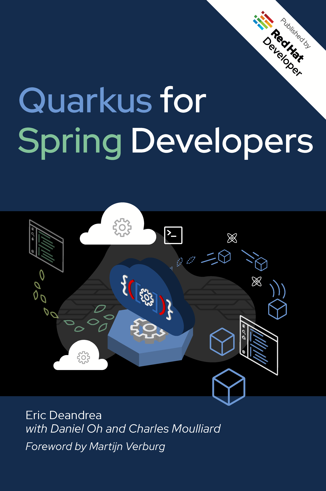

[Quarkus for Spring Developers](https://red.ht/quarkus-spring-devs) is a Spring Developer's ultimate resource to learn about Quarkus and Kubernetes-native Java. It showcases and explains how Quarkus enables modern Java development and the Kubernetes-native experience. Get introductions to familiar Spring concepts, constructs, and conventions [through equivalent code examples](https://github.com/quarkus-for-spring-developers/examples), then learn how they map to Quarkus. It additionally places emphasis on testing patterns and practices.
